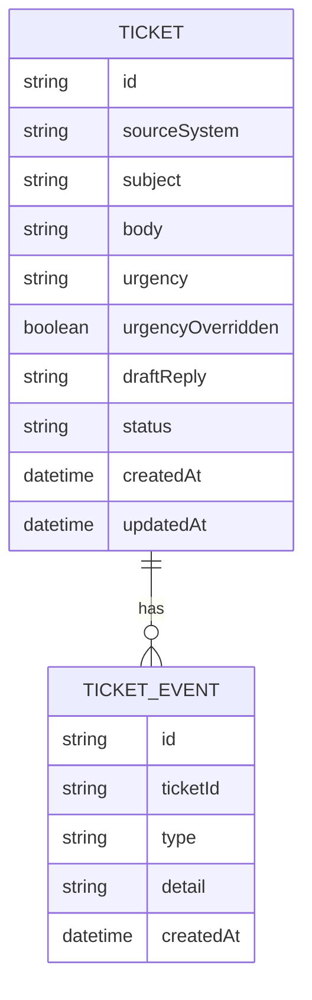

# Domain Model

A ticket arrives through the public ingestion endpoint, is classified and
drafted by the triage agent, and then carries every subsequent action a
Support Agent takes on it as an event on its history.

**Ticket** is the unit of work: `urgency` is one of Low/Medium/High/Critical,
initially set by the triage agent and flippable by a Support Agent
(`urgencyOverridden` records that it was). `status` moves through
`new → triaged → approved` or `new → triaged → rejected → triaged` (a
rejection asks the agent for a new draft and returns to `triaged`).

**TicketEvent** is the audit trail: one row per state change — submitted,
classified, drafted, urgency overridden, draft edited, approved, rejected —
so a ticket's full history can be replayed in order.