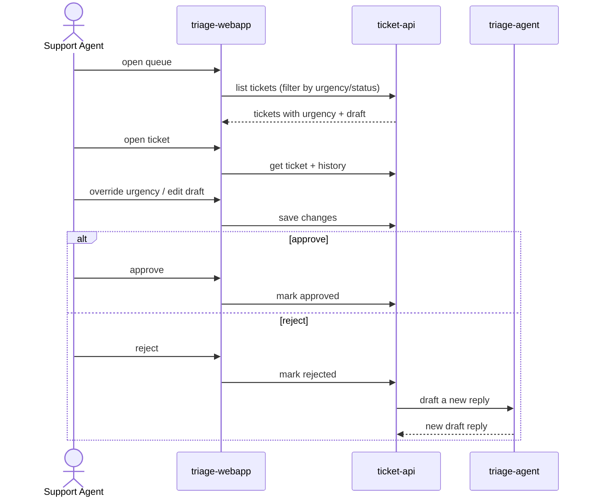

# Queue review and approval

A Support Agent works the shared queue: reviewing urgency and the drafted
reply, editing or overriding either, then approving or rejecting.

```mermaid
sequenceDiagram
    actor SupportAgent as Support Agent
    participant triage-webapp
    participant ticket-api
    participant triage-agent

    SupportAgent->>triage-webapp: open queue
    triage-webapp->>ticket-api: list tickets (filter by urgency/status)
    ticket-api-->>triage-webapp: tickets with urgency + draft
    SupportAgent->>triage-webapp: open ticket
    triage-webapp->>ticket-api: get ticket + history
    SupportAgent->>triage-webapp: override urgency / edit draft
    triage-webapp->>ticket-api: save changes
    alt approve
        SupportAgent->>triage-webapp: approve
        triage-webapp->>ticket-api: mark approved
    else reject
        SupportAgent->>triage-webapp: reject
        triage-webapp->>ticket-api: mark rejected
        ticket-api->>triage-agent: draft a new reply
        triage-agent-->>ticket-api: new draft reply
    end
```

