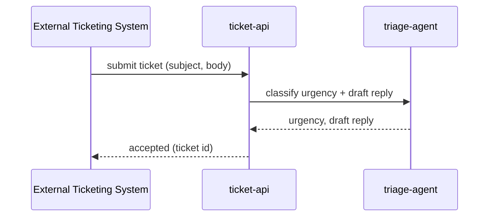

# Ticket ingestion and triage

An external ticketing system pushes a new ticket, and the triage agent
classifies its urgency and drafts a reply before any Support Agent sees it.

```mermaid
sequenceDiagram
    participant ticket-source as External Ticketing System
    participant ticket-api
    participant triage-agent

    ticket-source->>ticket-api: submit ticket (subject, body)
    ticket-api->>triage-agent: classify urgency + draft reply
    triage-agent-->>ticket-api: urgency, draft reply
    ticket-api-->>ticket-source: accepted (ticket id)
```

